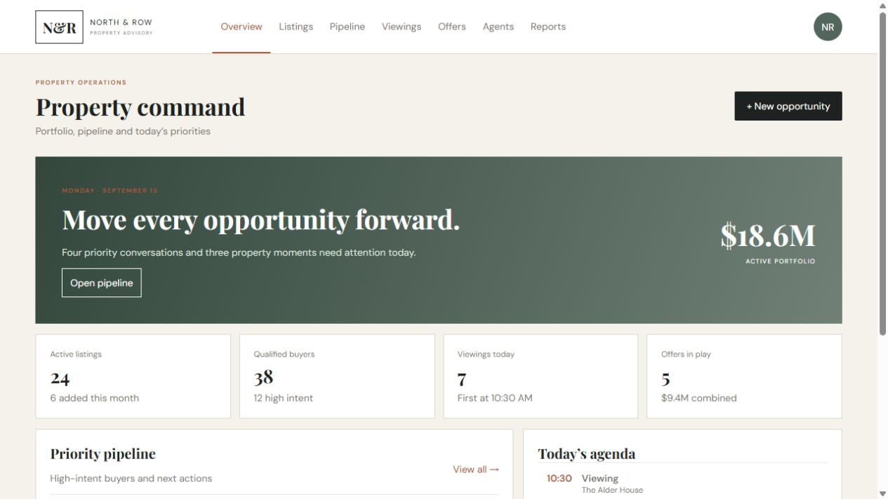
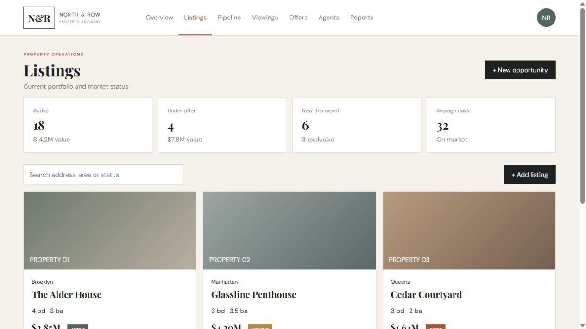
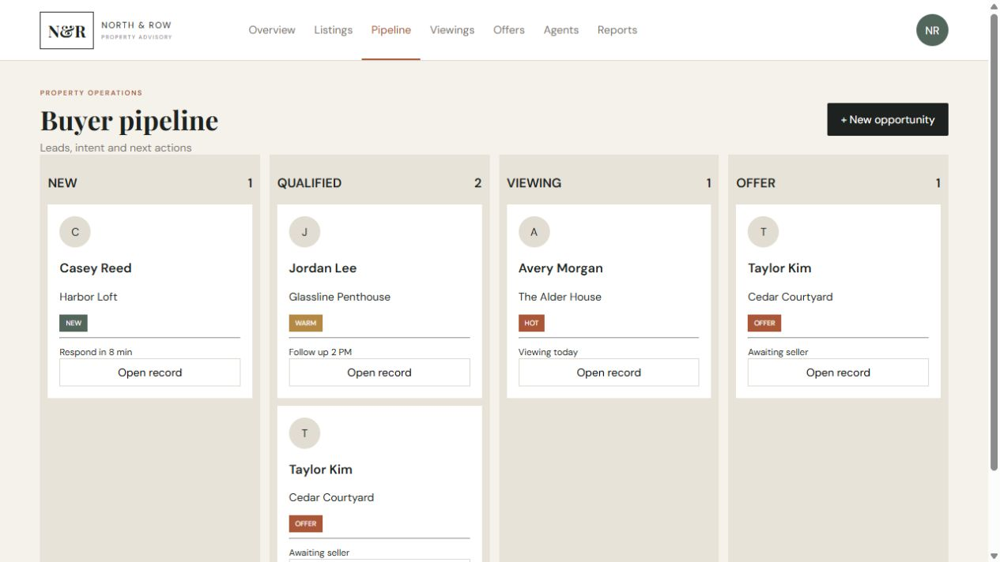
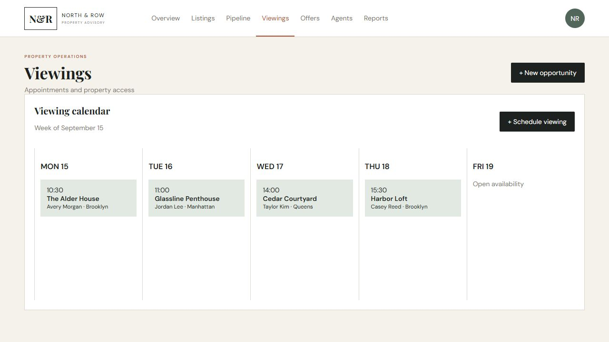
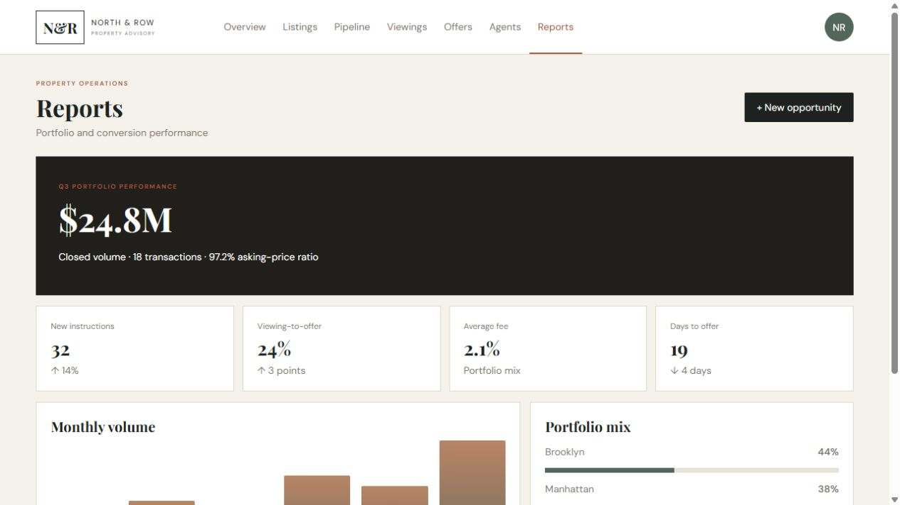
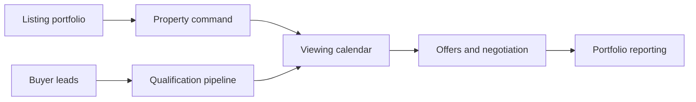

# Real Estate Command Center — Portfolio Showcase

A sanitized portfolio case study for a property-sales operating system covering listings, buyer qualification, viewing coordination, offers, agent performance, follow-ups, and conversion reporting.

## Product preview

| Property command | Listings |
| --- | --- |
|  |  |
| Buyer pipeline | Viewing calendar |
|  |  |

Open `demo/index.html` for the safe static preview. The complete interactive source remains private. All properties, buyers, agents, prices, appointments, and performance values are fictional. No private address, contact detail, credential, document, or production API is included.

[Rico Integration](https://ricointegration.com/)
